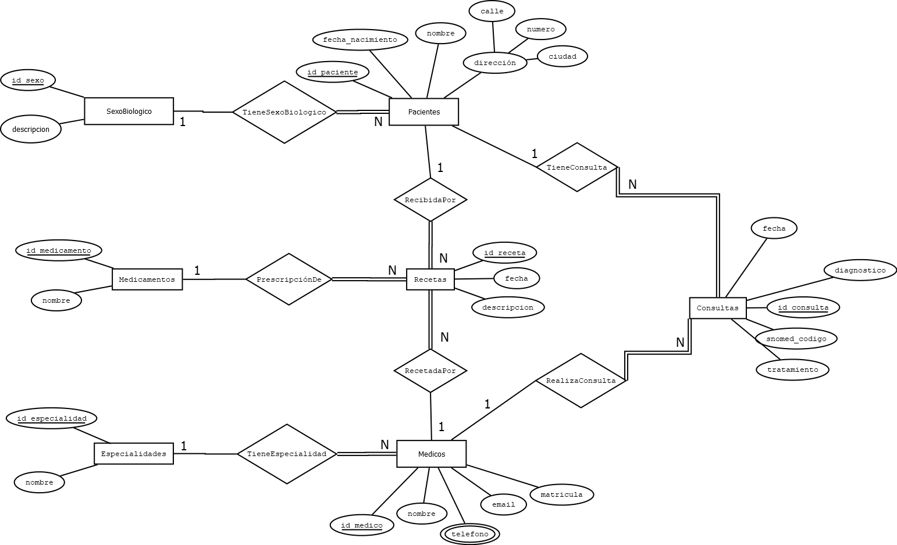
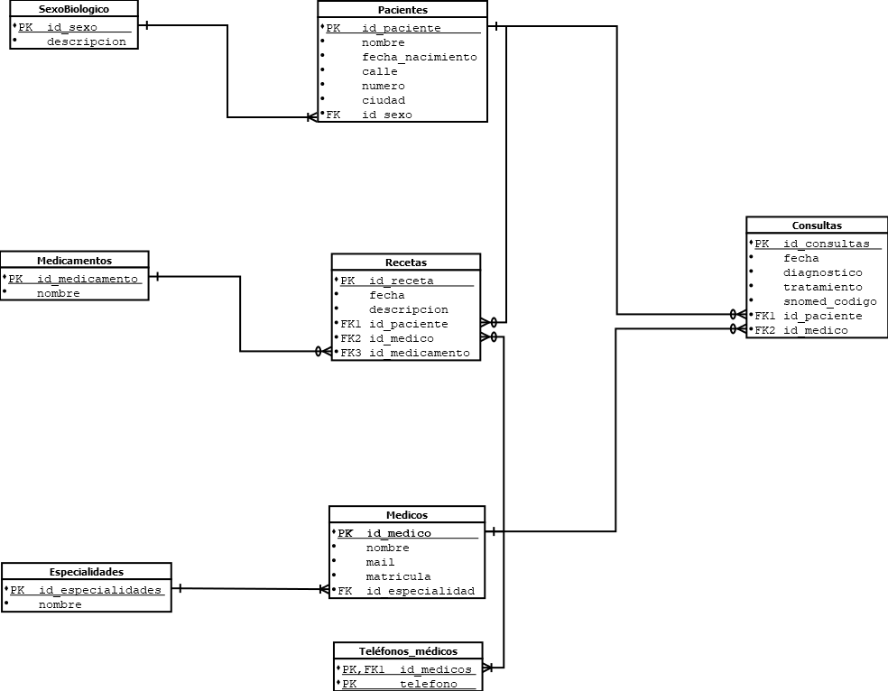
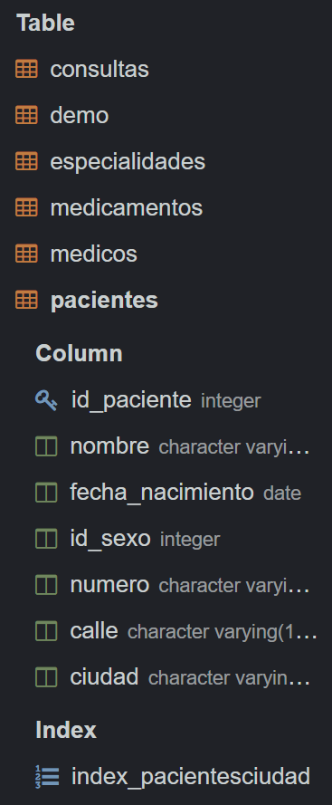
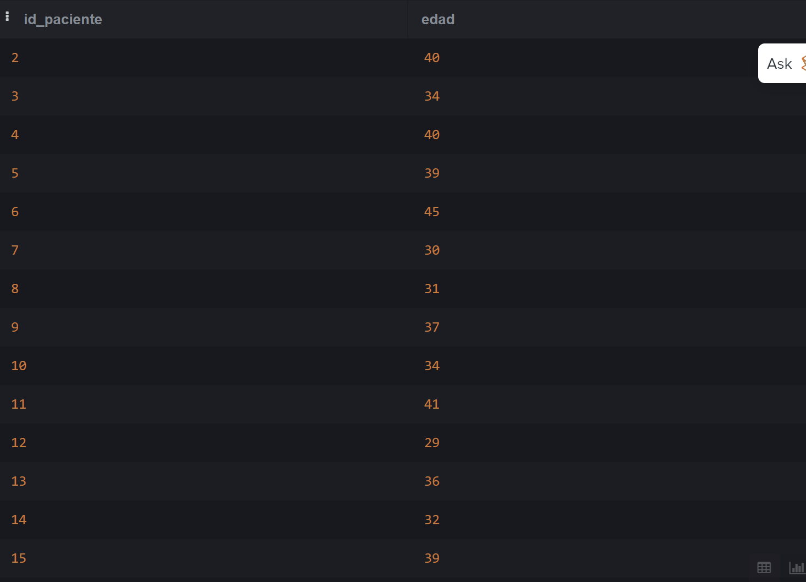
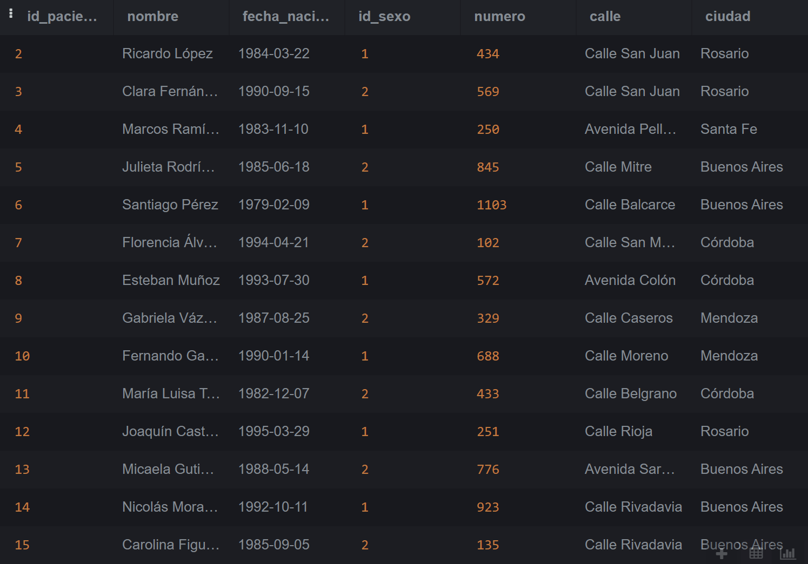
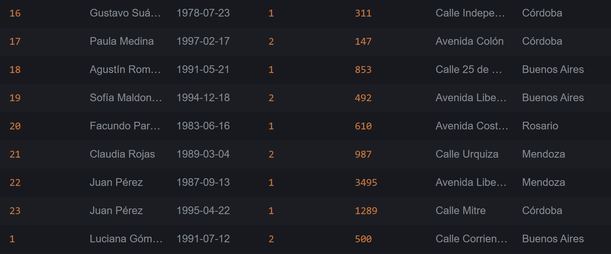
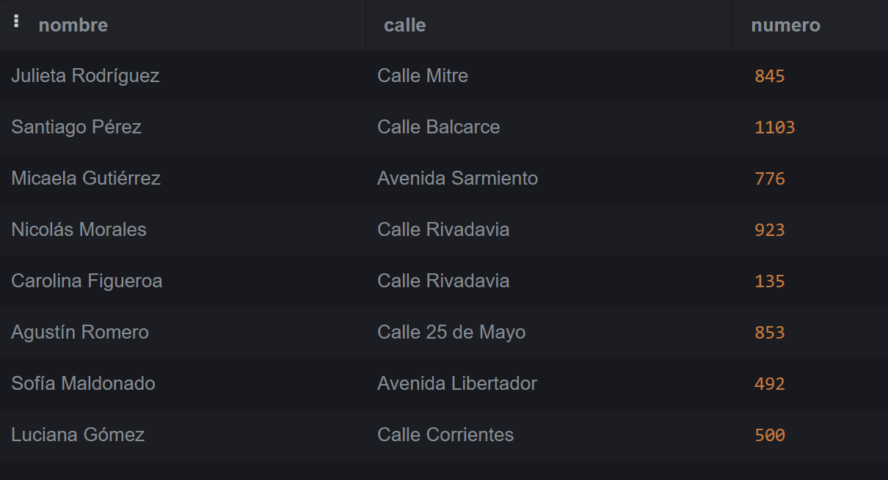
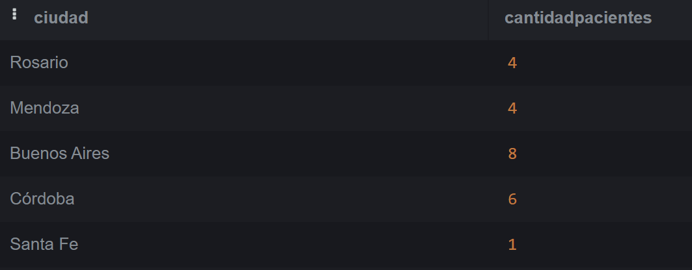
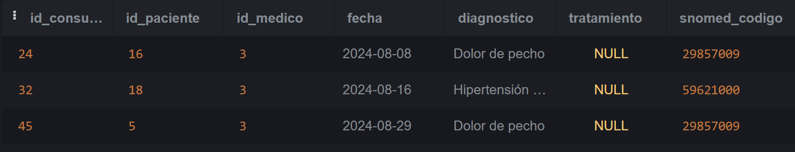

# Trabajo Práctico N°5


## _Autoras:_ 
* Francesca Catterina Picon Abucci
* María Virginia Ramos Marca

## **PARTE 1:** Bases de Datos

### 1. ¿Qué tipo de base de datos es? 

La base de datos utiliza un modelo relacional. Esto significa que los datos están organizados en tablas que contienen registros de entidades como pacientes, médicos y medicamentos. Cada tabla tiene columnas que representan los atributos de las entidades (por ejemplo, el nombre y la fecha de nacimiento de los pacientes), y las relaciones entre ellas se establecen mediante claves primarias y foráneas. Por ejemplo, la tabla Consultas se relaciona con las tablas Pacientes y Medicos, lo que permite vincular a un paciente con el médico que lo atendió en una consulta específica.

A su vez, la base de datos es transaccional, lo que significa que está diseñada para realizar operaciones rápidas y eficientes. Por ejemplo, al registrar una nueva consulta, la base de datos actualiza automáticamente los registros correspondientes en las tablas de Pacientes, Medicos y Consultas, asegurando que toda la información esté sincronizada y disponible para el personal médico.

### 2. Armar el diagrama entidad-relación de la base de datos dada. 


El diagrama de entidad-relación (ER) fue realizado utilizando la aplicación Dia, una herramienta de software libre que permite crear diagramas con facilidad y exportarlos en formatos como PNG. Para este proyecto, se asumió que las entidades Consultas, Recetas, Pacientes, Medicos, Especialidades, y Medicamentos son todas entidades fuertes, ya que tienen claves primarias propias. Las relaciones entre las entidades se definieron principalmente como de 1 a N. En particular, las relaciones entre Consultas con Pacientes y Medicos, así como las relaciones entre Recetas con Medicamentos, Pacientes, y Medicos, tienen participación total desde el lado de Consultas y Recetas (doble línea), mientras que las entidades Pacientes, Medicos, Especialidades, y Medicamentos tienen participación parcial (línea simple).

### 3. Armar el Modelo relacional de la base de datos dada.


En este modelo relacional, todos los atributos de las tablas (Pacientes, Medicos, Consultas, Recetas, Especialidades, Medicamentos, y SexoBiologico) se han definido como no nulos, dado que consideramos que toda la información es esencial. Las relaciones entre las tablas son de uno a 0..N en la mayoría de los casos, permitiendo que un paciente o médico tenga 0 o más consultas o recetas asociadas. La única excepción es la relación entre Medicos y Especialidades, donde cada médico debe tener obligatoriamente una especialidad, lo que hace que esta relación sea de 1 a N. Las claves primarias están subrayadas y las claves foráneas aseguran la integridad referencial entre las tablas.

### 4. Considera que la base de datos está normalizada. En caso que no lo esté, ¿cómo podría hacerlo?

La base de datos no está completamente normalizada. Por ejemplo, para normalizar la tabla Consultas y llevarla a la Tercera Forma Normal, se puede dividir en tres tablas: Consultas, Diagnósticos, y Tratamientos. La tabla Diagnósticos contendría los detalles del diagnóstico y su código SNOMED, mientras que la tabla Tratamientos almacenaría los tratamientos asociados a cada diagnóstico. La tabla Consultas mantendría una clave foránea hacia Diagnósticos en lugar de almacenar directamente el diagnóstico y el tratamiento, evitando así cualquier dependencia transitoria entre los atributos. Esto garantiza que el tratamiento dependa únicamente del diagnóstico y no de la consulta, logrando que la base de datos cumpla con los requisitos de la 3NF, donde todos los atributos no clave dependen exclusivamente de la clave primaria.


## **PARTE 2:** Bases de Datos

### 1. Cuando se realizan consultas sobre la tabla paciente agrupando por ciudad los tiempos de respuesta son demasiado largos. Proponer mediante una query SQL una solución a este problema.

```
CREATE INDEX index_pacientesciudad ON Pacientes(ciudad);
```


### 2. Se tiene la fecha de nacimiento de los pacientes. Se desea calcular la edad de los pacientes y almacenarla de forma dinámica en el sistema ya que es un valor típicamente consultado, junto con otra información relevante del paciente.

```
SELECT 
    id_paciente,
    EXTRACT(YEAR FROM AGE(fecha_nacimiento)) AS edad
FROM Pacientes;
```



### 3. La paciente, “Luciana Gómez”, ha cambiado de dirección. Antes vivía en “Avenida Las Heras 121” en “Buenos Aires”, pero ahora vive en “Calle Corrientes 500” en “Buenos Aires”. Actualizar la dirección de este paciente en la base de datos.

```
UPDATE Pacientes
SET calle = 'Calle Corrientes', numero = '500', ciudad = 'Buenos Aires'
WHERE nombre = 'Luciana Gómez' 
  AND calle = 'Avenida Las Heras' 
  AND numero = '121'
  AND ciudad = 'Bs Aires';
```


### 4. Seleccionar el nombre y la matrícula de cada médico cuya especialidad sea identificada por el id 4.

```
SELECT nombre, matricula
FROM Medicos
WHERE especialidad_id = 4;
```


### 5. Puede pasar que haya inconsistencias en la forma en la que están escritos los nombres de las ciudades, ¿cómo se corrige esto? Agregar la query correspondiente.

```
UPDATE Pacientes
SET ciudad = CASE
    WHEN ciudad ILIKE '%buen%' AND ciudad ILIKE '%ai%' THEN 'Buenos Aires'
    WHEN ciudad ILIKE '%rosar%' THEN 'Rosario'
    WHEN ciudad ILIKE '%santa%' AND ciudad ILIKE '%fe%' THEN 'Santa Fe'
    WHEN ciudad ILIKE '%cordob%' OR ciudad ILIKE '%coro%'OR ciudad ILIKE '%córodba%' THEN 'Córdoba'
    WHEN ciudad ILIKE '%mend%' THEN 'Mendoza'
    ELSE ciudad
END;
```



### 6. Obtener el nombre y la dirección de los pacientes que viven en Buenos Aires.

```
SELECT nombre, calle, numero
FROM Pacientes
WHERE ciudad = 'Buenos Aires';
```


### 7. Cantidad de pacientes que viven en cada ciudad.

```
SELECT ciudad, COUNT(*) AS cantidadpacientes
FROM Pacientes
GROUP BY ciudad;
```


### 8. Cantidad de pacientes por sexo que viven en cada ciudad.

```
SELECT p.ciudad, s.descripcion AS sexo, COUNT(*) AS cantidad_pacientes
FROM Pacientes p
JOIN SexoBiologico s ON p.id_sexo = s.id_sexo
GROUP BY p.ciudad, s.descripcion
ORDER BY p.ciudad;
```


### 9. Obtener la cantidad de recetas emitidas por cada médico.

```
SELECT m.nombre AS medico, COUNT(*) AS cantidad_recetas
FROM Recetas r
JOIN Medicos m ON r.id_medico = m.id_medico
GROUP BY m.nombre;
```


### 10. Obtener todas las consultas médicas realizadas por el médico con ID igual a 3 durante el mes de agosto de 2024.

```
SELECT *
FROM Consultas
WHERE id_medico = 3
  AND fecha BETWEEN '2024-08-01' AND '2024-08-31';
```
